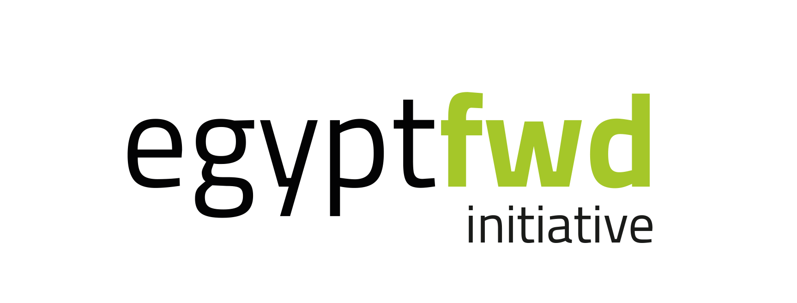

# 

> ### This project is an online shopping site that includes some of the tools we learned in the Angular Cross Skilling.

This codebase was created to demonstrate a fully fledged application built with Angular that interacts with an actual backend server including CRUD operations, authentication, routing, pagination, and more. We've gone to great lengths to adhere to the [Angular Styleguide](https://angular.io/styleguide) & best practices.

# How it works

It works on displaying products and adding them to the cart, then displaying their details, adjusting the quantity, then adding payment data, and then the payment process is completed successfully

# Brief description

This is an online shopping site where you can browse the products and add them to the shopping cart, you can visit the shopping cart page to see the products you have added to the cart and delete what you want, then you can fill in your payment card information and pay for the products

# Getting started

Make sure you have the [Angular CLI](https://github.com/angular/angular-cli#installation) installed globally. We use [Yarn](https://yarnpkg.com) to manage the dependencies, so we strongly recommend you to use it. you can install it from [Here](https://yarnpkg.com/en/docs/install), then run `yarn install` to resolve all dependencies (might take a minute).

Run `ng serve` for a dev server. Navigate to `http://localhost:4200/`. The app will automatically reload if you change any of the source files.

### Building the project
Run `ng build` to build the project. The build artifacts will be stored in the `dist/` directory. Use the `-prod` flag for a production build.

